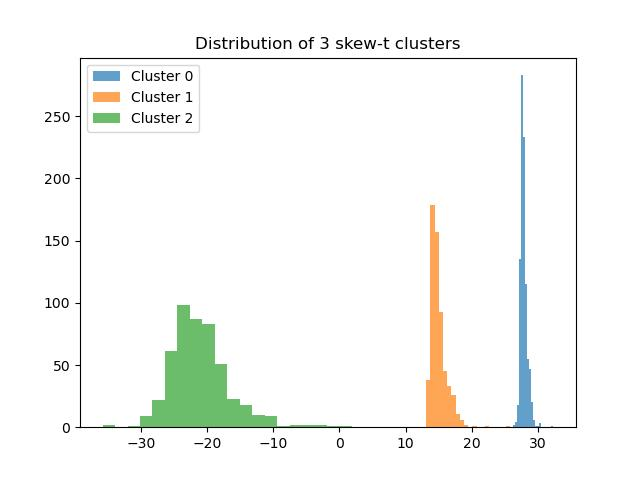

.. _doc.stats.Skew:

Stats
=====

Skew-t
------

Random cluster distribution
~~~~~~~~~~~~~~~~~~~~~~~~~~~~

The Skew-t distribution can be described as a continuous probability distribution that incorporates skewness and heavy tails, making it more flexible in modeling asymmetric data with outliers compared to the normal distribution. 
It extends the Student's t-distribution by including a skewness parameter.

The random variate \( Y \) from a Skew-t distribution is given by:

.. math::
       Y = \mu + \sigma \frac{Z}{\sqrt{\tau}}, \qquad Z\sim\mathcal{SN}(\mu=0, \sigma=1, \lambda), \qquad \tau\sim\Gamma\left(\frac{\nu}{2}, \frac{\nu}{2}\right) 

With 

:math:`\mu` : location parameter

:math:`\sigma` : scale parameter

:math:`\nu` : degrees of freedom

:math:`\lambda` : skewness parameter

:math:`\Gamma` : gamma distribution

 **Special Cases:**
   - When :math:`\lambda=0` and :math:`\nu\to\infty`, the Skew-t distribution reduces to the normal distribution.
   - When :math:`\lambda=0`, the Skew-t distribution reduces to the Student's t-distribution.

**Examples:**

.. code-block:: python

    >>> from cassiopy.stats import Skew
    >>> sm = Skew()
    >>> data, labels = sm.rvs(n_samples=200, n_dim=2, n_clusters=3, random_state=123)
    >>> data.shape
    (200, 2)
    >>> labels.shape
    (200,)

**See also**

:func:`Skew-t rvs <cassiopy.stats.Skew.random_cluster>`

Probability density function
~~~~~~~~~~~~~~~~~~~~~~~~~~~~

The probability density function (pdf) of the skew-t distribution is given by:

.. math::
    f(x|\mu,\sigma^2, \lambda, \nu) = \frac{2}{\sigma} t_{\nu}(\eta) T_{\nu+1}\left(\lambda \eta \sqrt{\frac{\nu +1}{\eta^2 +\nu}}\right) 
    
Where :
:math:`\eta = \frac{x-\mu}{\sigma}`

:math:`\mu` : location parameter, :math:`\sigma` : scale parameter, :math:`\lambda` : skewness parameter, :math:`\nu` : degrees of freedom

:math:`t_{\nu}` : Student-t probability density with \nu degrees of freedom

:math:`T_{\nu+1}` : Student-t cumulative distribution with \nu+1 degrees of freedom

**Examples:**

.. code-block:: python

    >>> from cassiopy.stats import Skew
    >>> sm = Skew()
    >>> x, mu, sigma, nu, lamb = 0.5, 0, 1, 10, 0.5
    >>> sm.pdf(x, mu, sigma, nu, lamb)
    0.3520653267642995   

**See also**

:func:`Skew-t pdf <cassiopy.stats.Skew.pdf>`
