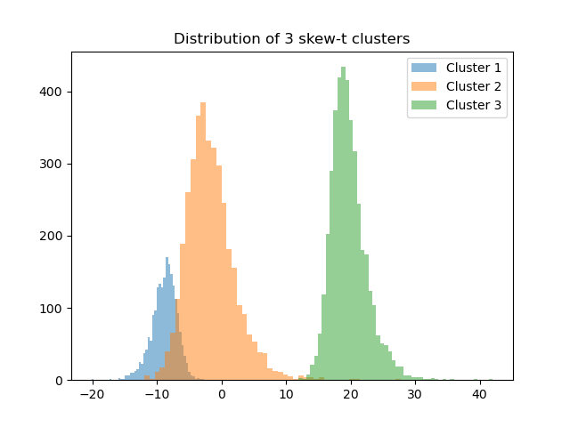

.. _doc.stats.SkewT:

Statistic 
==========

Skew-t distribution
-------------------

The Skew-t distribution can be described as a continuous probability distribution that incorporates skewness and heavy tails, making it more flexible in modeling asymmetric data with outliers compared to the normal distribution. 
It extends the Student's t-distribution by including a skewness parameter.

A random variable X follows a skew-t distribution if it can be represented by:

.. math::
       X = \mu + \sigma \frac{U}{\sqrt{\tau}}, \qquad with \qquad U\sim\mathcal{SN}(\mu=0, \sigma=1, \lambda), \qquad \tau\sim\Gamma\left(\frac{\nu}{2}, \frac{\nu}{2}\right) 

With 

:math:`\mu \in \mathbb{R}` : location parameter

:math:`\sigma \in \mathbb{R^*_+}` : scale parameter

:math:`\nu \in \mathbb{R^*_+}` : degrees of freedom

:math:`\lambda \in \mathbb{R}` : skewness parameter

:math:`\Gamma(\alpha, \beta)` : gamma distribution with shape parameter :math:`\alpha` and an inverse scale parameter :math:`\beta`

:math:`\mathcal{SN}` : standard normal distribution with parameter :math:`\lambda`

:math:`\mathcal{SN}(x) = 2\phi(x)\Phi(\lambda x)` with :math:`\phi` the standard normal density and :math:`\Phi` the standard normal cumulative distribution function

 **Special Cases:**
   - When :math:`\lambda=0` and :math:`\nu\to\infty`, the Skew-t distribution reduces to the normal distribution.
   - When :math:`\lambda=0`, the Skew-t distribution reduces to the Student's t-distribution.

**Examples:**

.. code-block:: python

    >>> from cassiopy.stats import Skew
    >>> sm = SkewT()
    >>> data, labels = sm.random_cluster(n_samples=3000, n_dim=1, n_clusters=3,random_state=10, labels=True)
    >>> data.shape
    (3000, 1)
    >>> labels.shape
    (3000,)

   >>> # Plot a graph of the distribution
   >>> fig, ax = plt.subplots()
   >>> ax.hist(data[labels==0], bins=20, alpha=0.4, label='Cluster 0')
   >>> ax.hist(data[labels==1], bins=20, alpha=0.4, label='Cluster 1')
   >>> ax.hist(data[labels==2], bins=20, alpha=0.4, label='Cluster 2')

   >>> ax.legend()
   >>> plt.title('Distribution of 3 skew-t clusters')
   >>> plt.show()

**See also**

:func:`Skew-t random cluster <cassiopy.stats.SkewT.random_cluster>`, :func:`Skew-t rvs <cassiopy.stats.SkewT.rvs>`

Probability density function
----------------------------

The probability density function (pdf) of the skew-t distribution is given by:

.. math::
    f(x|\mu,\sigma^2, \lambda, \nu) = \frac{2}{\sigma} t_{\nu}(\eta) T_{\nu+1}\left(\lambda \eta \sqrt{\frac{\nu +1}{\eta^2 +\nu}}\right) 
    
Where :
:math:`\eta = \frac{x-\mu}{\sigma}`

:math:`\mu` : location parameter, :math:`\sigma` : scale parameter, :math:`\lambda` : skewness parameter, :math:`\nu` : degrees of freedom

:math:`t_{\nu}` : Student-t probability density with :math:`\nu` degrees of freedom

:math:`T_{\nu+1}` : Student-t cumulative distribution with :math:`\nu+1` degrees of freedom

**Examples:**

.. code-block:: python

    >>> from cassiopy.stats import SkewT 
    >>> data = SkewT().rvs(mean=0, sigma=1, nu=1, lamb=5, n_samples=10000)
    >>> data=data[(data[:, 0]>-20) & (data[:, 0]<20)]
    >>> pdf_data = SkewT().pdf(data, mean=0, sigma=1, nu=1, lamb=5)

    >>> # Plot a graph of the distribution and the pdf
    >>> sorted_data = data[data[:, 0].argsort()]
    >>> sorted_pdf_data = pdf_data[data[:, 0].argsort()]

    >>> plt.hist(sorted_data, bins=300, density=True, label='distribution')
    >>> plt.plot(sorted_data, sorted_pdf_data, color='red', label='SkewT pdf')
    >>> plt.legend()

.. dropdown:: References

   .. bibliography:: referencePDF.bib
      :all:

**See also**

:func:`Skew-t pdf <cassiopy.stats.SkewT.pdf>`
